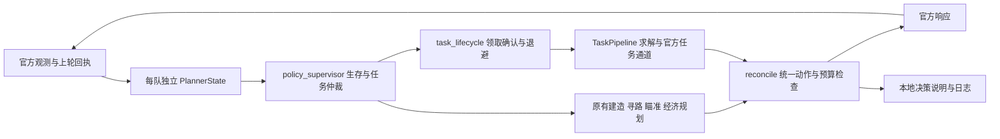

# 根据一次真实日志迭代策略架构

来源为同一次测试拆分的 Issue #14–#17，共 362 个连续回合。对应包内源码 `00a08bd7eb0e571f01c0420b2459d42e370519cd`，不是后续已经交付的防御布局版本。原始 Issue 仍是证据源；摘要不等同于可精确回放的完整请求数据。

## 这次日志能说明什么

| 观测 | 可以据此推进 | 不能据此断言 |
|---|---|---|
| 身份校验、Python3.11.10、连续362轮响应 | 这份包在该次平台运行中已启动并处理请求 | 所有上传失败都已解决、整场已通过 |
| 34 次 acceptTask、3 次 submitAnswer | 检查按点位的可领取状态、等待确认和重复重试 | 每次领取都失败、任务答案具体错在哪里 |
| 第一天只有两名工人出现于攻击分配，开拓者存活 | 检查任务保持是否覆盖回防 | 单靠摘要确定其位置、射程或阻挡原因 |
| 基地一级，最后观测 HP60；无 buy | 补充金币/价格/升级状态，检查生存与经济优先级 | 已观察到基地死亡、金币足够却一定没买 |
| robots_visible 峰值70/45/58 | 记录全局可见数量，另分我方目标数量 | 这些就是我方每夜刷怪数量 |
| 旧 protocol_errors 有6次非零 | 修正错误分类并记录实际 errorCode | 达到6次接口违规或被平台停调度 |

后续实施以 [三类LLM任务路线图](../specs/LLM_TASKS_ROADMAP.md) 为准；首批确定性工作见 [P0a子Spec](../specs/LLM_TASKS_P0A.md)。路线图中的能力均需逐阶段验收，不代表当前已全部实现。

## 阵营与敌我

我方可以是红方或蓝方；以每次请求的 `teamOur` 为己方、`teamEnemy` 为敌方，阵营身份读取 `teamOur.type`。任务点按该身份匹配，机器人 `targetTeam` 与该身份比较，基地和角色使用请求中的实际坐标/ID。颜色、左上/右下位置、100xx/200xx前缀均不作为敌我判断依据。
本地页面用青色/红色区分相对的我方/敌方，是观看视角配色，不表示我方固定属于比赛蓝方。前述换边比较已分别覆盖 challenger 与 defender；颜色与接口枚举的官方对应关系不能仅凭本地配色认定。

## 分层决策

### 监督层

`policy_supervisor.py` 不造新动作，只决定开拓者何时必须保留给炮塔。依据是公开昼夜、己方角色/武器分配、距离和可见机器人；不读取模拟器种子、未来波次或隐藏敌人。
夜间根据基地是否受损、是否有近敌、可见敌人总生命值和己方武器/工人分配评估是否召回先锋；远处已知攻击对方的机器人不算我方近敌，未知目标保守计入压力。全图射程不会把对方远处机器人自动算成我方近敌。
在执行模式下，白天进入回防窗口后通常召回先锋；基地完整时，允许已经确认的任务或已经持有全部材料且仍可完成的寻宝继续，避免中途白白丢掉投入。基地受损取消这个例外。需要防守时，任务等待、任务行走和寻宝不能覆盖必要防御指令。任务记忆和待返回结果保留，暂停不冒充任务成功/失败。没有相应防御需要时，仍允许任务继续。
**当前默认分阶段启用**：已观测基地受损时执行回防仲裁；基地完整时，新增的回防建议只记录为 `watch` / `recommended_reserve`，不覆盖原有行为。原因是留出场景左右换边出现得分一升一降，尚不能把健康基地上的提前召回认定为净改善。`enforce_healthy_base=False` 明确控制该阶段；之后根据真实观测和更广泛基准再决定启用。
这是围绕生存优先目标的渐进调整，不是数学上的基地必然安全保证；炮塔火力、实际刷新及地图可达性仍影响结果。

### 任务生命周期

`task_lifecycle.py` 管理按任务点的可领取状态与重试，不改变官方任务规则：

1. 只有当前位置对应的己方任务点确实可领取，才发 acceptTask；不能借用另一个点的 isValid，也不能在所有点冷却时回退成地图点可领取。
2. 发出指令只是尝试。等待判题器的任务原文；指令合法回执本身不等于已经拿到可执行任务。
3. 原文延迟时短暂等待；明确拒绝或迟迟未发布时按该点退避。明确的空 playerTasks 列表不会凭地图凭空生成可领取任务。另一个就绪点不被全队冷却误伤。
4. 收到原文和超时参数后进入正常求解，保留原始领取轮次。未知 deadline 为 null，不能按0当成马上过期。
5. 任务保留范围绑定已领取的点；站到另一个任务点不延续原任务。不能私自多给一格范围。

回防裕量、确认等待窗口和重试上限在各模块的 tuning dataclass 中，属于可调整的策略选择。官方昼夜长度、HP、价格、动作额度、任务保持距离等不是调参项。当前是规则策略与状态机，尚不是神经网络，也没有仅凭这份日志完成强化学习。

### 状态与解释

`PlannerState` 保存每队的任务记忆、领取退避、提交历史和监督层摘要；模拟器经过 JSON 来回传输也保留这些状态。预览使用分离的状态，不把预览当成执行。
决策说明是进程内部的元数据，含监督模式、保留开拓者的理由、任务确认状态和本轮任务计划类型；不加入官方响应字段，不包含任务正文、模型提示词或凭据。

## 后续数据闭环

控制台保留异常、状态转折和周期摘要；完整逐轮 JSONL 独立保留。下一次据实际 errorCode、金币、武器等级、动作回执与监督层理由定位问题，再提炼独立回归用例。不要把本地模拟分数、角色消失、发出攻击或缺失回执包装成官方执行成功。
参数位于 `SupervisorTuning`（回防裕量3、近敌半径4、每名已分配工人的压力预算80 HP）和 `AcceptanceTuning`（确认等待3轮、最大退避16轮）。这些是待校准的工程启发式，尤其“压力预算”不是武器伤害公式或火力安全证明；真实平台复测后再调整。官方生命值、昼夜长度与保持范围不随这些参数改变。

统一输出阶段增加操控者互斥：角色有自身动作时不能同时操炮，同一操控者也不能操作两座炮；任务保持即使没有角色动作，也显式释放此前的操炮提案。这是 R01 的实现修复。

这轮不因缺少 buy 就盲调购买阈值或更换阵容，也不将任务提交次数当成正确率。完整请求/动作/下一轮观测可以支持更精确的模型评估；只有摘要时，保留未确认项。

## 规则与未覆盖项

变更类别：官方实现修复（R01 / 接口§2.2：操控者互斥；R07 / 任务书§五、接口§1.3.2：可领取状态和任务范围）、策略优化（生存/任务仲裁）、UI工具（日志与离线分析）。未改官方动作、数值、胜负与资源限制。
任务点2优先使用实际发布的所有格；仅有一个锚点时仍沿用既有向右扩展假设，方向需用真实地图核对。无任务记忆恢复时可按当前位置重建所在任务点，但不能从摘要恢复精确原始领取轮次。自然语言宝藏推理、官方沙盒真实执行、真实地图/刷怪/火力和内网整场结果仍需实测；不是本次日志能够证明的事项。
