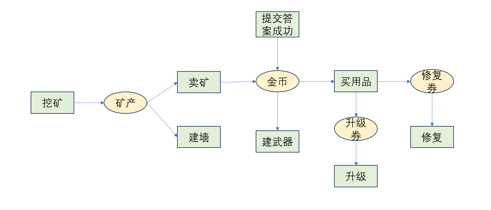
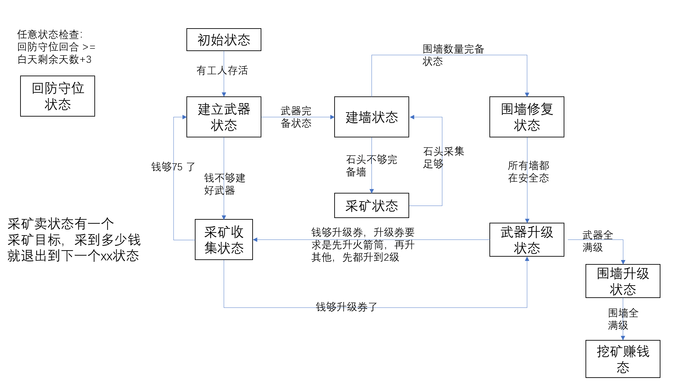

从两方面入手：
最后决策是动作，动作有哪些？影响因素有哪些

12类动作：move、attack、sell（小贩卖）、buy（武器商店买）、build（建造武器/墙）、remove（拆墙）、acceptTask（领取任务）、submitAnswer（提交答案）、召唤宝藏、use（使用物品）、drop（丢弃物品）、collect（收集矿）

开拓者特有动作：acceptTask（领取任务）、submitAnswer（提交答案）、召唤宝藏（3个开拓者独有）
工人特有动作：build（建造武器/墙）、remove（拆墙）、collect（收集矿）（3个工人独有）
共有动作：move、attack、buy、sell、use、drop（6个共有）

解析通用动作：
1. move：朝着某一个地方去，本质上是有一个目的地target，然后寻路到最近的下一步
    - 注意点：寻路应该是一个全局最优寻路，动作两步走战略，只有寻路涉及两步走
2. attack：操作武器，本质上就是选择一个武器操作，更多的是到武器点的逻辑（武器操作点）
3. buy：购买道具（买什么主要还是武器升级券吧）
4. sell：卖东西（卖什么，什么时候卖）
5. use：什么时候用
6. drop：先废弃，暂时用不到

决策出这一回合的行为？还是说按照天计算，本质上来说，每一个行为都是move + purpose的抽象，move是最终决策
比如
    attack target：
        if 在范围，就攻击， else 就移到附近（有武器依赖）
    buy：
        if 在范围，就买， else 移动到商人处（有金币依赖）
    sell：
        if 在范围，就卖， else 移动到小贩处（有矿石依赖）
    use：
        if 在范围，就用， else 移动到小贩处（有商品依赖）

工人特有动作：
    build：
        if 在范围，就建， else 移动到可建立位置（有物品/金币依赖）
    remove:
        if 在范围，就拆， else 移动到可拆卸位置
    collect：
        if 在矿范围，就挖，else 移动到矿的位置

开拓者特有动作：
    acceptTask（领取任务）
        if 在范围，就接， else 移动到任务点
    submitAnswer（提交答案）
        依赖是否产生答案

每一轮决策出行为Action和Target，然后再进行统一寻路（最优寻路），然后生成最后的行为（行为生成器）

分清楚Target 和 Action，Target是目标，Action是行为

寻路算法要注意，如果role移动到其他位置，移动到的位置才是障碍位置，原位置成为可通行位置

## 三步决策
1. 决策现在要干啥（动作级决策，全局性质的策略）
2. 决策现在干哪个啥（目标级决策，每个目标级别的策略）
3. 决策这一步干啥（下一步决策）

### 全局级策略
基于状态机执行策略

#### 游戏需求分析
1. 基本防御建设需求：建立武器 + 建立墙
2. 资源获取需求：采矿（矿资源）+ 卖矿（金币资源）+ 买物品
3. 防御升级修复需求：使用商店物品

只有挖矿没有依赖
1、挖什么矿（石头 or 最贵的矿）：最贵的需要考虑回合数，也许收益并不是最高的

防御需求：（基础防御工事）
1、武器打人，墙阻拦进攻
    优先级：先建立武器，后建立墙

武器工事晋级需求：
需要金币，需要采矿

采矿决策：
采哪个矿？

