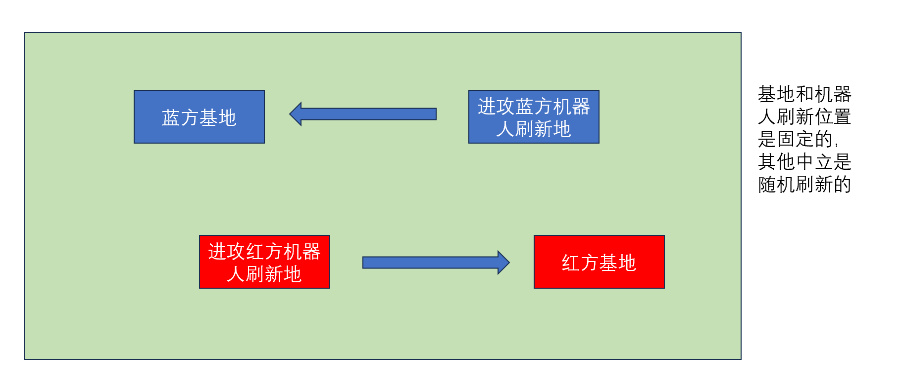
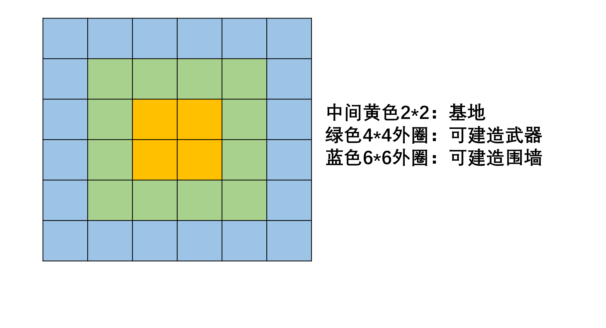

## 任务书分析
### 时间维度
每130回合是一天，70天白天，60天晚上

分析：白天必须好好修筑防御工事，晚上很长

### 角色 && 行为
角色： 工人work、开拓者poineer
角色信息：
- 工人: 220血量 + 100格背包，主要用于采集资源+建造
- 开拓者：200血量 + 40格背包，主要用于完成任务

### 地图信息
地图信息类型包括：空地、角色、建筑（工事、基地、围墙）、中立单位（小贩、武器商店、任务点）、矿区



| 单位类型   | 初始数量 | 数量上限 | 等级   | 攻击冷却 | 攻击距离 | 血量 | 攻击力 | 建造代价 |
| ---------- | -------- | -------- | ------ | -------- | -------- | ---- | ------ | -------- |
| 基地       | 1        | 1        | level1 | /        | /        | 1500 | /      | /        |
|            |          |          | level2 |          |          | 3000 |        |          |
|            |          |          | level3 |          |          | 4500 |        |          |
| 加特林炮台 | 0        | 3        | level1 | /        | 3        | 1000 | 10*1   | 25金币   |
|            |          |          | level2 |          | 5        | 1500 | 10*2   |          |
|            |          |          | level3 |          | 7        | 2000 | 10*3   |          |
| 电磁狙击炮 | 0        | 3        | level1 | /        | 6        | 1000 | 10     | 25金币   |
|            |          |          | level2 |          | 8        | 1500 | 20     |          |
|            |          |          | level3 |          | 10       | 2000 | 30     |          |
| 火箭发射台 | 0        | 3        | level1 | 3回合    | 10       | 1000 | 20*1   | 25金币   |
|            |          |          | level2 |          | 15       | 1500 | 20*2   |          |
|            |          |          | level3 |          | 全图     | 2000 | 20*3   |          |
| 围墙       | 0        | /        | level1 | /        | /        | 1000 | /      | 石头*1   |
|            |          |          | level2 |          |          | 1500 |        |          |
|            |          |          | level3 |          |          | 2000 |        |          |

- 建筑：用于防御的障碍物
建筑只能在特定区域建造


- 矿区：石矿、铁矿、铜矿随机刷新，每个矿最多采集十次

- 中立单位：小贩、任务点、商店
    1. 小贩：买矿产，价格随着新闻的变化而变化
    2. 任务点：2个任务点，用于开拓者接任务
    3. 商店：购买建筑升级券 + 消耗品 + 任务物品

        | 商品（中文 / 英文）                  | 效果                             | 金额 |
        | ------------------------------------ | ------------------------------ | ---- |
        | 武器升级券1 / WeaponUpgradeVoucher1  | 目标武器等级level1->level2       | 100  |
        | 围墙升级券1 / WallUpgradeVoucher1    | 指定单座围墙等级level1->level2   | 20   |
        | 基地升级券1 / StationUpgradeVoucher1 | 基地等级level1->level2           | 100  |
        | 武器升级券2 / WeaponUpgradeVoucher2  | 目标武器等级level2->level3        | 150  |
        | 围墙升级券2 / WallUpgradeVoucher2    | 指定单座围墙等级level2->level3    | 30   |
        | 基地升级券2 / StationUpgradeVoucher2 | 基地等级level2->level3            | 150  |
        | 围墙修复包 / WallFixer               | 目标坐标所在围墙回满血             | 10   |
        | 生命药剂 / Medicine     | 使用者回满血                                   | 10   |
        | 眩晕法宝 / DizzyWeapon    | 目标坐标为中心的 3×3 范围内机器人眩晕 5 回合   | 100  |
        | 范围炸弹 / Bomb        | 目标坐标为中心的 3×3 范围内机器人造成 100 伤害 | 100  |
        | 小型机器人召唤令 / SmallRobotSummonOrder  | 对方下个夜晚小型机器人个数+1     | 20   |
        | 中型机器人召唤令 / MiddleRobotSummonOrder | 对方下个夜晚中型机器人个数+1     | 30   |
        | 大型机器人召唤令 / LargeRobotSummonOrder  | 对方下个夜晚大型机器人个数+1       | 100  |
        | BOSS召唤令 / BossRobotSummonOrder         | 对方下个夜晚BOSS机器人个数+1 | 200  |
        | 古符石板 / AcientTablet | 灰白色石板，表面刻有无法辨认的远古文字，触摸时发出微弱的嗡鸣声 | 15   |
        | 星辰之沙 / StarSand     | 一小袋银白色细沙，在暗处会自行闪烁冷光，触感冰凉             | 15   |
        | 烈焰之息 / FlameBreath  | 透明晶石瓶，内封一团橙红色雾气，晃动时雾气自行发光发热       | 15   |
        | 寒霜药剂 / FrostPotion  | 深蓝色粘稠液体，瓶口始终结着一层薄霜，靠近时感到刺骨寒意     | 15   |
        | 荆棘护符 / ThornAmulet  | 以活藤蔓编织的圆形护符，表面布满细密尖刺，散发淡淡的草木气味 | 15   |
        | 回音铁哨 / IronWhistle  | 生铁铸造的哨子，表面布满锈迹，摇晃时内部有金属片碰撞的脆响   | 15   |

地图分析：
1. 基地位置和机器人刷新位置是固定的，防守的时候优先朝着机器人刷新位置建墙，红蓝方建墙不一致
2. 武器在第一天就可以建好，三台武器都需要
3. 第一天白天中，工人的任务是收集石块建立墙，开拓者的任务是去任务点接任务赚积分和金币
4. 武器只有建立三个才有意义，建立多了没有意义

### 晚上机器人进攻潮

机器人属性：

| 机器人 | 攻击力 | 攻击距离 | HP   | 积分 |
| ------ | ------ | -------- | ---- | :--: |
| 小型   | 5      | 3        | 40   |  1   |
| 中型   | 10     | 3        | 60   |  2   |
| 大型   | 20     | 3        | 500  |  4   |
| BOSS   | 40     | 3        | 800  |  10  |

分析：杀机器人是一个极大的得分手段

行为：

- 机器人会在夜晚第一个回合统一出现，数量随着天数的增加而增加。
- 机器人会攻击阻挡其移动的单位（包括角色/建筑）。
- 黑夜结束后，在第二天早上的第一个回合，残余机器人自动清除。
- 购买的机器人召唤令将会叠加在基础机器人进攻浪潮之上。

### 任务

三类任务：推理类、长上下文类、自进化类

- 推理类

【官方消息】报导的突发事件会引起供需关系发生变化，进而影响玩家与小贩之间的交易价格。

**示例：**

```
【官方消息】：
"矿业管理局紧急通报：北部铁矿区昨夜发生严重矿井塌方事故，主巷道结构受损，部分作业面被掩埋。安全监察部门已下达通知：为保障矿工安全，矿区将于明日全面停工，进行巷道加固和主矿脉修复。矿区领班表示：'今天浅层矿面还能抢采一些，明天的全面停工不可避免。'工程队评估：类似规模的塌方事故，修复工程通常需要2天左右才能完成并恢复开采。"
```

对游戏影响：

- 当天：铁矿采集不受影响。
- 明天+后天：铁矿无法采集，无法产出铁资源，同时由于铁的稀缺，小贩回收铁的价格上涨。
- 大后天及之后：铁矿恢复可采集，小贩回收铁的价格恢复到原来的价格。

- 长上下文类

【民间传闻】记录着市井消息，玩家需要控制开拓者收集关键信息，携带相关物品，前往祭坛召唤宝藏，获取祭坛宝藏。

**示例：**

```
DAY1: 【民间传闻】：情报1
DAY2: 【民间传闻】：情报2
...
DAYN：【民间传闻】：情报N
```

玩家需要根据情报1~情报N消息，找到关键信息，携带相关物品，前往祭坛召唤宝藏，获取祭坛宝藏，宝藏藏有大量积分与金币。

注意：

- 一张地图宝藏只有一个，成功开启后，后续继续开启则不会获得宝藏奖励。
- 宝藏需要开拓者通过召唤宝藏动作开启。
- 宝藏地点、宝藏开启条件，宝藏开启时间，均需要玩家根据民间传闻推断出。
- 若同一回合内双方均满足宝藏开启条件并且都正确使用了召唤宝藏指令，则双方均获得宝藏奖励。

- 自进化类

开拓者前往2个任务点接取自进化类任务，根据任务描述需要，与沙盒环境进行交互，最终提交答案信息。

**示例：**

```
给你一个三方的天气查询API接口文档，让你通过该API查询天气：
任务1：请查询北京天气
任务2：请查询上海天气
任务3：请查询广州天气
...
```

玩家需要根据任务1探索的内容，形成固定SOP或者SKILL，实现Agent自进化，进而快速做出后续任务。

## 策略分析

1. 第一天开局策略：
分析是在左上角还是右下角，决定墙的优先建筑方向，武器一台在基地后方，两台在基地前方的两角（这样才能维修/升级基地和武器），墙建立在面向机器人进攻的方向（保护基地），开拓者去找任务点做任务
要点：
- 工人最先建立武器，然后找石矿建墙，找石矿应该要去最近的，另外必须在晚上到来前将墙建好，注意计算回合数
- 开拓者要去寻找任务接任务

2. 采矿策略：
手里面保持能建造墙的石头量就行，然后选择价格最高的矿，没有波动的情况下是铜 > 铁 > 石头