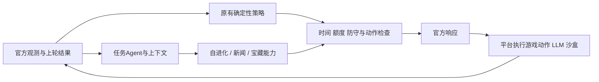

# 三类任务的 LLM 能力建设 Spec v1

- 状态：设计基线；各阶段须分别实现、审核和验证，本文不代表功能已完成。
- 来源：用户在本对话要求分阶段实现三类任务，并允许 DSH 完成确定性修改和测试；未新建来源 Issue。
- 调研基线：80525916de8b4cd775fa207fbe601806cf50a2f8（codex/sgh）。各派单以当时已审核 HEAD 重新绑定 base SHA、文件指纹和 Spec 哈希。
- 类别：策略优化、官方接口实现修复、模拟器/诊断工具；不修改官方规则定义。
- 规则依据：[开发合同](../docs/DEVELOPMENT_RULES.md) R01/R02/R03/R06/R07/R08；[任务书](../docs/任务书.md) §4.6、§4.8、§5.1–5.3、§六、§八；[接口文档](../docs/接口文档.md) §1.1、§1.3.2、§1.7、§2.1–2.2。
- 设计负责人/阶段审核：Codex。实施：按任务适配度由 Codex 或 DSH 专员承担。

## 1. 问题与目标

当前程序控制开拓者的移动、任务和回防。LLM 只是任务模块的一个求解器，尚没有完整的多步工具循环。三类任务的目标不同，不应统一当成“去任务点问模型再提交答案”。

| 类型 | 官方输入与输出 | 当前状态 | 目标 |
|---|---|---|---|
| 自进化任务 | 任务点领取；phaseTask；prompt/executeCmd；submitAnswer | 已接基础请求/回执和领取确认；探查简单，回答验证与经验复用不足 | 多轮探索、求解、验证、错误修正；复用经验证的方法 |
| 推理任务 | worldNews.officialNews；通过采矿/交易等行动利用信息 | 有价格读取和经济策略，没有完整 LLM 新闻分析链 | 形成有来源、时间范围和不确定性的经济建议 |
| 长上下文任务 | worldNews.folkLegends；购买/移动/summonTreasure | 部分结构化传闻解析及寻宝行动；缺跨日线索推理 | 累积线索、处理冲突，推断地点/时段/献祭物品并执行 |

旧日志 #14–#17 的362轮只保留摘要，34次领取指令、3次提交不等于34道真实任务或零分证明。不得用缺少原文的旧日志构造“已经复现了实际题目”的报告。

目标优先级：遵守官方接口与权限 → 保持基地生存约束 → 在相同规则下争取更多官方积分与金币。接受尝试数、LLM调用次数、命令成功退出都不是任务成功指标。

本轮不做神经网络训练、LoRA/RL、不修改价格/HP/得分公式、不把本地夹具当成官方题库、不直接改成全局 LLM 控制走路或炮塔瞄准。

## 2. 不可改动的执行边界

1. 我方来自 teamOur，阵营来自 teamOur.type，可为 challenger 或 defender；不得按颜色、坐标半场、ID前缀判断己方。保持实际基地/任务点坐标与角色ID。
2. 官方响应仅使用 roleCommandMap、prompt、executeCmd。任务ID、模型计划、上下文、预算、经验库均是内部状态，不向判题器要求额外字段。
3. HTTP建立连接超过10秒、发请求后5秒内未响应为超时；我们的每轮处理快速给出下一步，不在请求线程等完整模型推理或工具执行。工具命令由平台执行，单次上限15秒；长任务拆成多回合，仍受任务timeoutRounds约束。
4. 普通每日3次LLM额度按130回合/日重置。官方自进化任务从接取到结束期间不受该日限且不占普通额度。确认前不得仅凭本地cycle对象存在就假定额度豁免；确认/结束判断必须对接phaseTask、合法范围、死亡/超时和实际回执。状态不明时保守调度并记录，不把推理预算无限化。
5. executeCmd只在有效任务期间发送；结果按lastCmdResult的exitCode/TIMEOUT/JUDGER_ERROR/TRUNCATED语义读取。沙盒无外网，不能凭空假定天气公网API、文件路径或已安装依赖可用。
6. 每角色每轮至多一条动作；操控武器也占角色动作额度。继续使用统一金币预留、落点协调与操控者互斥，LLM建议不能绕过这些检查。
7. 已发行的健康基地风险建议watch模式继续保留，不能借本Spec静默扩大强制召回范围。任务可能因离开范围结束，调度层不能宣称暂停后必然能继续原题。
8. 私有_demo、种子、未来新闻/波次、题目答案和本地判题状态不得进入模型prompt或策略输入。仅对已公布观测产生判断，未来推测标为推测。

## 3. 总体设计与内部接口

流程：官方观测 → 状态与回执归属 → 三类能力提出请求 → 统一LLM/工具调度 → 结构化结果校验 → 确定性行动规划 → 官方响应。

用户确认的架构理解：在现有策略上增加一个职责独立的任务Agent子系统。初期是同一Python参赛进程内的模块，不新增必须部署的外部服务，不给每个游戏角色各放一个LLM。DSH仅参与开发实施，不是比赛运行时的Agent服务。原策略继续控制移动/采矿/建造/瞄准/防守，任务Agent提出认知请求和行动建议，统一调度拥有最终执行权。

拟新增模块名是职责建议，P0需先确定实际API；禁止一次性重写全部brain/tasks/simulator。

| 职责 | 建议模块/接入点 | 要求 |
|---|---|---|
| 共享请求归属与预算 | llm_router.py、planner.py、sandbox.py | 全队共享普通额度；区分任务/新闻/宝藏调用；待返回请求不能被新请求覆盖 |
| 上下文构建 | task_context.py | 每题原文、输出契约、相关工具结果、已验证事实、失败记录与下一步；保留来源，限制体积 |
| 多步自进化 | task_agent.py、tasks.py | 状态机输出下一步计划；由程序审核并翻译为官方字段 |
| 同类方法复用 | task_skills.py | 有环境/接口指纹和适用条件的SOP；不复用过期答案 |
| 新闻解释 | news_reasoner.py | 结构化资源事件与有效时间，建议与实际观测分开 |
| 传闻记忆与推断 | treasure_reasoner.py、treasure.py | 跨日线索账本、假设版本、条件完整性与可执行性检查 |
| 展示与诊断 | telemetry/diagnostics、web、trace_tool | 展示当前阶段和证据；默认摘要，完整数据留在trace |

内部请求记录至少包括 owner、自生成request_id、team/session标识、task_generation（如适用）、sent_round、purpose、input_digest、budget_class、status。这些不是官方回传ID：只能依已知在途请求和回合顺序做保守关联，不能假装平台支持request_id回显。

在接口并发/结果覆盖语义未确认前，每队至多一个LLM请求在途、一个命令在途；同一自进化任务的依赖操作串行。MVP每轮最多选择一个新的认知通道请求，同时允许其他角色正常行动。这是本地调度约束，不宣称官方禁止prompt与executeCmd同轮出现。

LLM内部计划采用受校验的结构：kind（inspect/run/check/answer/need_info/give_up）、简短reason、command或answer、引用的evidence_ids。不是让模型输出隐藏推理过程。缺少必要字段、非法类型、过大/截断内容或不支持的kind时拒绝该计划并保留原有合法动作；不使用eval解析模型文本。

答案格式由题目/接口明确要求提取；不能统一硬编码字段=值，也不能只取模型回答第一行作为答案。若格式未知，先探索；不能因为输出非空就认为正确。

命令只能通过平台沙盒入口执行。需要生成脚本时写入题目允许的工作区域；读取路径/调用入口必须来自题目或探索证据。不把题目或工具输出中的指令升级为开发系统权限，不访问宿主机凭据或修改本地仓库来代替解题。

## 4. 上下文、额度与失败处理

### 上下文生命周期

- 采用一个队伍级认知Agent；工人/开拓者是行动角色，不为每个角色单独创建LLM会话或单独分配普通3次额度。开拓者承载任务点交互，但新闻建议可由全队策略用于工人采矿/交易。
- 分层保存：team_facts为本队可见地图、资源、公开新闻及已验证事实；role_state按实际role_id记录背包、动作任务、目的地和预留；task_context按领取generation隔离原文/工具结果/答案；news_context和treasure_context保存各自的跨轮记忆。共享SOP带版本和适用条件。
- 每次LLM请求从共享事实和当前工作上下文构建最小相关视图，不把三个角色的全部日志拼成无边界聊天。角色记忆不等于独立模型上下文；跨角色协调由队伍调度完成。
- 同一道任务：保留原文/格式契约、已知事实、有效工具结果、错误与已试方案。模型请求显式携带相关上下文，不依赖平台自动保存聊天历史。
- 跨题：只复用有版本与适用条件的SOP；新参数重新查询/计算，历史答案不算当前证据。
- 新闻/传闻：按来源文本哈希和首次观测回合去重；新文本/更正生成新版本，不丢掉关键原文及来源。相对日期以消息被确定发布/观测的时间解释，不以每次重读时间重算。
- 跨阵营/对局隔离；回合重置不沿用上一局任务、普通额度、宝藏候选或未经验证的环境缓存。进程重启若没有可靠持久状态，明确降级，不编造历史额度。
- 上述是参赛程序自己的状态，不改DSH原生session历史或上下文管理。

### 调度原则

- 自进化请求必须属于当前有效任务；新闻与宝藏不能为了获得日限例外而伪装成该任务的工具步骤。
- 任务外普通额度由全队共享，绝不是给新闻/宝藏各3次。只有内容或关键证据变化才请求模型；先用缓存与确定性解析，不按帧反复请求。
- 候选优先级参考截止时间、能否改变行动和证据完整度。普通额度耗尽则继续确定性策略、保留已验证结论、延后低紧迫请求；开拓者仍能移动、领任务、回防和操炮。
- 是否计费在“本轮实际发出prompt”时登记；构建prompt、预览、排队未发出不扣本地额度。请求可能已被平台接收但回包失败时记录不确定并保守预留，防止重复发送透支。
- 超时、空响应、格式错误、同一命令反复无新信息必须有有限重试/退避；即使自进化不受日限，也不能无限循环。软预算由配置管理并明确属于策略参数，不改变官方上限。
- 任务结束/代际变化后，迟到的LLM/命令结果隔离记录，不写入新题。没有官方回传ID时，对无法确定归属的结果宁可丢弃而非猜配。
- 提交后等待真实回执；错误码2表示不正确或不完全正确，不能一律当零分。保留已有较好答案，不以最后一次答案覆盖最高通过率结算语义。若接口没给通过率，不能从猜测填入数值。

## 5. 分阶段交付与退出标准

阶段串行验收，可继续推进不依赖未知官方细节的工作；不要求用户先完成故障定位。每阶段的本地通过与内网通过分开登记。

| 阶段 | 交付范围 | 可观察的退出条件 |
|---|---|---|
| P0a 确定性基础修复 | 修复求解器注册优先级；验证日限、跨日与任务内豁免、JSON记忆 | 任意注册顺序均按各自priority执行；默认顺序不变；额度边界与状态测试通过。单独派单见LLM_TASKS_P0A.md |
| P0b 共享运行底座 | 统一请求归属、在途状态、确认后的额度分类、持久任务上下文和失效处理 | 3类请求争用时无覆盖/串题/重复扣额度；第4次普通调用被阻止，已确认任务仍可调用；重置/迟到结果不污染新题 |
| P1 自进化多轮解题 | 从题目/文档/沙盒结果构建计划；执行、验证、提交和纠错循环 | 本地未知路径查询、计算、格式变更、一次错误后修正4类固定用例均完成；输出与独立标准答案一致；没有假成功或宿主机执行 |
| P2 方法复用 | 提炼验证过的SOP及适用条件，跨同类题应用；失效后重新探索 | 同接口换参数仍查真实数据；同名但接口版本改变不误复用；在冻结测试集上复用后正确性不降，并记录减少的操作轮数 |
| P3 新闻推理 | 解析资源事件/时间，接入经济建议与普通额度调度 | 两日停矿/价格方向/恢复日正确解析；重复新闻不再调用；未知涨价幅度不造价格；实时vendorShopList优先于预测用于成交 |
| P4 多日宝藏 | 新闻记忆、约束合并、冲突/缺项检测，接入购买/寻路/召唤 | 分三天发布线索可组合完成；缺项、冲突、窗口已过、材料不齐时不盲目献祭；重复线索不重复买/召唤；两种阵营可用 |
| P5 综合调度与交付 | 三能力与防守共存、前端解释、平台trace对齐、消融比较 | 同局3类请求按共享预算运行；坏模型响应不阻塞防守；报告成功率、得分、耗时、调用量和生存差异；完成正式包与内网回测说明 |

### 各阶段文件边界

- P0a：仅tasks.py及新增确定性测试、聚合验证报告。沙盒/额度已有实现只读，发现新缺陷先返回证据。
- P0b：planner.py、sandbox.py、brain.py的调度接缝、新llm_router/task_context模块、对应测试；必要时调整trace允许字段。不改任务解答算法或防御数值。
- P1/P2：tasks.py、新task_agent/task_skills、已审核的P0接口；tests与隔离fixture。其余调度若确需变更，追加Spec差异。
- P3：news_reasoner、market/nightwork/brain中的经济建议接缝和上下文，测试及新闻fixture。不得让新闻预测直接改官方观测价格、地图或矿量。
- P4：treasure_reasoner、treasure/brain的公开线索接口和测试。移除策略对私有rite回退的依赖；模拟判题的rite仍可保存于独立环境中。
- 各阶段按需更新web、simulator/taskworld/local_llm的接口适配，但修改范围必须在阶段派单里列明；禁止把本地自动答题器当平台结果。
- 禁止修改官方任务书、接口原文、原始Demo压缩包/样例；禁止改workflow/state.py或顺带清理其他agent未提交工作。打包、commit/push和GitHub回写由Codex负责。

## 6. 模拟器与日志同步

每增加一种能力，同阶段交付最小可测fixture和回执适配，不能等所有阶段结束才补模拟器。

1. 比赛与模拟器调用同一公共观测→决策函数和同一任务状态机；模型/沙盒结果都跨回合送回。脚本化模型只用于确定性测试，另外标记真实模型试验，二者不混报。
2. 本地模拟器不得在宿主机无约束执行模型生成的Shell。确定性伪沙盒先支持文档读取、参数化查询、计算、退出码/截断/超时注入；真实执行仅使用显式隔离的测试环境。
3. 标准答案仅在测试判题侧；以手算数据或独立实现定义期望。改变文件路径、数据、语言表述、字段顺序和阵营，避免记住题目模板就“通过”。
4. 展示：当前任务原文入口、确认/探索/等待/验证/提交阶段、下一步简短原因、剩余回合、普通LLM已用/剩余额度、当前是否任务豁免、最近命令结果摘要。不要显示为“无限时间”。
5. trace保留获准采集的题目/请求/响应/工具结果、关联ID及来源SHA。控制台任务开始打印一次有界题目摘录和哈希，后续打印阶段变化/失败/结算观测；不逐轮重印原文。超长原文可通过trace查看，明确截断标记。
6. 新闻和宝藏面板分开列“已观测事实 / 模型推测 / 待确认”，保留线索来源回合。错误、执行失败、部分得分、完整成功分开统计。
7. 有平台trace时，先验证身份、连续性与脱敏变换；逐步比较同一观测下动作，再比较真实相邻观测与本地预测。缺少完整请求时只做摘要诊断，不伪造精确重放。

## 7. 验收矩阵与发布门槛

| 编号 | 独立预期 |
|---|---|
| A01 额度 | 普通3次允许，第4次不发；第130→131轮重置；任务内多次调用不改变普通已用数；任务结束后恢复普通计数 |
| A02 确认与归属 | 未确认领取不获本地额度豁免；题目切换/死亡/超时后旧结果不能提交给新题；两个阵营交错输入不共享记忆 |
| A03 异步与故障 | 在途请求不覆盖；无回执/截断/非法JSON/错误码5不造成无限循环；命令只能在任务期发出；游戏动作继续合法返回 |
| A04 答案 | 文本、JSON、字段/单位等以各题要求为准；正确退出码但内容错误必须判为未验证；不得仅凭总分变动归因为任务成功 |
| A05 方法 | 换城市/ID/文件名仍求新数据；环境签名变化重新探索；未经验证计划不能升级成可信SOP |
| A06 新闻 | 手工指定“今日D，明日停产两日”，结果生效D+1和D+2，D+3恢复；未给价格幅度则保持unknown；重复原文不滑动日期 |
| A07 宝藏 | 三段线索组合，缺一段则不提交；矛盾线索不强行选边；缺物品、超容量/预算、赶不上时段时不发非法动作；不读未来线索 |
| A08 基础策略 | 默认关闭新能力时旧有效行为保持；打开后无角色/操控者重复，无同轮预支卖矿收入；红蓝换边、不同出生点均合法 |
| A09 时间与资源 | 记录端到端HTTP p95/p99/max；目标本地p99≤1秒（工程裕量，非官方新增规则），每次回包<5秒；日志/模型适配故障不拖住回包；5秒以上必须判失败 |
| A10 模拟符合性 | 仅公开观测进入策略；两侧共享结算、sandbox和新闻题库未实现细节明示缺口/假设，不将fixture成功称为官方认证 |

所有确定性验收用例必须通过；涉及协议/策略/结算时运行python -m unittest discover -s tests -v以及git diff --check。使用开发种子1和留出种子90317、90601分别跑challenger/defender，保留基线和候选源码SHA/哈希；逐阶段最短覆盖相关窗口，综合阶段覆盖1300轮或真实终局。后续扩大冻结留出集，不能一边调参一边把同一批种子继续称为未见测试。

真实模型试验冻结模型/通道、prompt版本、可公开fixture版本和重复次数（初始每例至少3次，工程设置可调整），报告每次结果、成功率与调用成本。失败不得用脚本化答案替换以凑PASS；无API条件时标记BLOCKED，但确定性部分可继续。

对默认策略的推广采用分阶段开关：先记录建议，再对通过验收的能力启用。报告任务得分/总分与基地存活并列；候选造成已知留出集更多基地被毁，或未解释的得分回退时，不自动提升为默认。正确性修复造成旧非法收益消失要单独说明，不能回滚成违规行为。

## 8. 待官方接口/内网核对

以下只阻断依赖它的结论；不能借此停止P0或独立fixture工作：

- 平台LLM具体模型、prompt长度/输出长度、内部超时、是否自动带历史：未确认，按独立调用构造上下文。
- prompt与executeCmd同轮发送的顺序、回执覆盖/迟到/空值语义，以及是否有更强的官方任务ID：未确认，MVP保守串行。
- phaseTask在任务完成/部分正确/超时后何时清空；实际errorCode、通过率与任务归属字段：需要真实原始请求验证，不能从旧计数反推。
- sandbox目录、可访问的模拟API/数据、依赖、文件跨题/跨局持久性：由题目/环境探查确认，不能假定公网可访问。
- 新闻是否每日全量重复、是否有发布时间/撤回/更正，以及日期表达：记录原文和首次观测，歧义不自动定日。
- 宝藏坐标/时间/物品的实际文本形式、全局已开启是否有公开回执；任务点2的格子方向：未知就记录并保守处理。
- 已有本地任务得分、双队结算、地图/刷怪与平台的差异仍保留原差异清单。本Spec不宣称它们已同步完成。

## 9. DSH派单与阶段交付

每次只派一个已确定边界的子Spec；manifest绑定base SHA、干净工作树指纹、Spec SHA256。DSH用OpenRouter deepseek/deepseek-v4.1-flash/max，复用原生专员session；检查identity/status，失败按原生resume规则处理，不能因wait超时重发或接管。DSH不自行commit/push/改GitHub，不自批验收。Codex审核全部diff（含未跟踪文件），决定修正/继续/启用。

实施回执必须含文件清单、测试命令/结果、行为例子、仍缺的规则、阶段勾选和回退办法。先将已审核源码合入固定codex/sgh，再从确定源码SHA生成并验证根目录CoreGeek.tar.gz、sha256、manifest；记录源码SHA与交付SHA，不要求自引用一致。每个阶段给出公司电脑的拉取/上传步骤和该阶段应观察的结果。

运行代码交付需保留原版main3入口，并在Python3.11.10实际压缩包上做启动/POST/日志故障回退检查；正式稳定推广需对应SHA真实内网证据。纯Spec交付无需重打未变化的参赛程序。

## 10. 进度与首批工作

- [x] P0a：注册器排序与额度/状态回归已实现并经Codex审核；验证见[首批报告](../reports/llm-tasks-p0a/REVIEW.md)。
- [ ] P0b：DSH原生turn14已完成并经父级修复；共享通道、隔离、预算与JSON持久化已验证。原文保留/检索及前端入口已接通并验证；整体最终审计仍未完成，不能再记为DSH正在运行。
- [x] P1：多轮Agent已接入；3组真实模型任务通过、7次脚本化模拟器任务结算通过，错误反馈可在同题重试。见reports/llm-tasks-real-integration。
- [x] P2：SOP已接入并验证换参、同路径文档改版和固定脚本消融；该证据不代表真实模型平均提速。见reports/llm-tasks-multiday。
- [ ] P3：新闻已接入采矿策略；日期/来源/预算/更正测试通过，16384上限的四日真实模型/路由复测通过（9请求含1次提供方错误后恢复），见reports/llm-tasks-real-world-v2。原失败批次保留；重复样本与最终综合审计待完成。
- [ ] P4：多日记忆与购买/寻路/召唤已接通；四日真实解释复测通过。寻宝完整费用/路径/轮次及任务优先级修复已过708测试，候选完整对局仍在运行；长文档任务也已真模型通过，见reports/llm-tasks-real-long-context，不能替代任意长篇传闻验证。
- [ ] P5：两批共28场1300轮对局完成，1/90713全功能得分下降，90317/90601四组提升（reports/llm-tasks-full-games和llm-tasks-required-seeds）。完成指定种子覆盖，尚需修正版对照、默认推广决策、重复模型样本、HTTP延迟和正式包交付。证据面板已在独立UI分支验证，整合待当前冻结评测结束。

当前接入说明见[Agent集成](LLM_TASKS_AGENT_INTEGRATION.md)和[WorldAgent](LLM_TASKS_WORLD_AGENT.md)。P5仍需要长文能力、同局三类请求、前端诊断、完整1300轮/留出对照及正式包交付，不能以现有组件或420轮试验缩小整体目标。

2026-09-15：P0b已绑定34f838a派单；后续边界见[P1多轮求解](LLM_TASKS_P1.md)、
[P3/P4新闻与多日宝藏](LLM_TASKS_P3_P4.md)。P1本地判题与沙盒基础的覆盖范围见
[审核记录](../reports/llm-tasks-p1-foundation/README.md)，不替代模型自主解题与整局验收。
